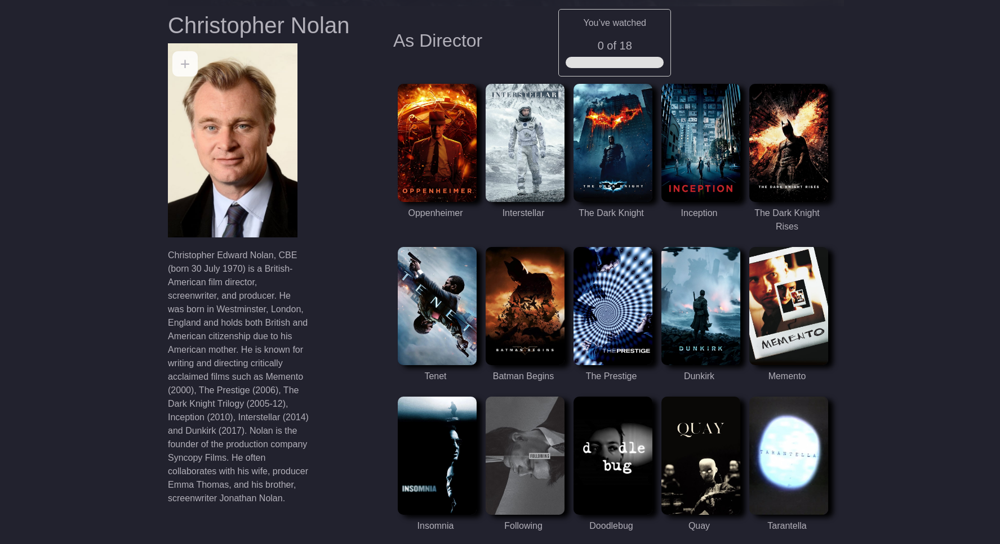
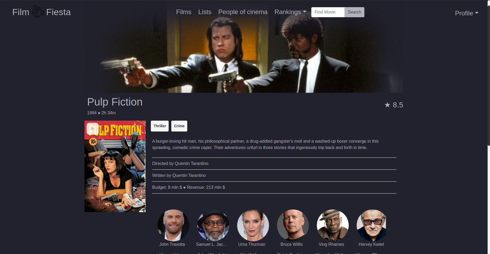

# Movie-App
FilmFIesta is a film-themed project, the appearance and some functionalities have been created in the likeness of internet sites such as [IMDB](https://www.imdb.com/), [Filmweb](https://www.filmweb.pl/) or [Letterboxd](https://letterboxd.com/).

## Features
- data scraping with BeautifulSoup and Selenium
- using the TMDB API to retrieve the most important information about movies and people of cinema
- Redis&Celery for refreshing rankings every 24 hours
- CI : running test on push
- using Postgres DB
- using signals and transactions from Django 
- CRUD functionality with list of movies/people
- rating and adding to watchlist funtionality
- CRUD functionality with reviews/comments
- user authentication system
- password reset by sending an email with a link
- template-based interface styled with bootstrap


## 🛠 Skills
<p align="left">  
    <a href="https://www.python.org" target="_blank" rel="noreferrer">  </a>
    <a href="https://www.djangoproject.com/" target="_blank" rel="noreferrer">  </a> 
    <a href="https://www.docker.com/" target="_blank" rel="noreferrer">  </a>  
    <a href="https://www.postgresql.org" target="_blank" rel="noreferrer">  </a> 
    <a href="https://redis.io" target="_blank" rel="noreferrer">  </a>
    <a href="https://www.selenium.dev" target="_blank" rel="noreferrer">  </a>
    <a href="https://getbootstrap.com" target="_blank" rel="noreferrer">  </a>
    <a href="https://www.w3.org/html/" target="_blank" rel="noreferrer">  </a>
    <a href="https://www.w3schools.com/css/" target="_blank" rel="noreferrer">  </a>
    <a href="https://www.gnu.org/software/bash/" target="_blank" rel="noreferrer">     </a>
</p>

## Preview






    
## Requirements
* docker and docker compose
* python>=3.10

## Installation
Firstly, clone the repository from the github to your local folder with the following command:
```
git clone https://github.com/Milosz-cat/Movie-App.git
```

Next, create an `.env` file where the `docker-compose.yml` is and copy the content from the `.env.sample` file:
```
cp .env.sample .env
```

If you want to run the application on a different host than localhost run:
```
python scripts/run_update_env.py
```

To get access to the TMDB API, you need to create an account on the [TMDB website](https://www.themoviedb.org/) and verify your email.
Then go to Profile Icon > Settings > API > Create > DeveloperExample, Accept Terms of Use, Submit Form. 
After this go again to API page and you will be able to copy API KEY and API Read Access Token (BEARER).  

For sending e-mails to work properly on your gamil, you need to go to settings and enable two-step verification and then set a password for the application. Here is helpful  [link.](https://dev.to/abderrahmanemustapha/how-to-send-email-with-django-and-gmail-in-production-the-right-way-24ab)

If you encounter any problem while trying to key access to tmdb API or functionality to send e-mails write to me and I will share my personal data with you. [](mailto:miloszbochenek20@gmail.com)  

Example:
```env
SECRET_KEY=ENTER_YOUR_SECRET_KEY_HERE
DEBUG=True
ALLOWED_HOSTS=127.0.0.1 0.0.0.0

TMDB_API_KEY=ENTER_YOUR_TMDB_API_KEY_HERE
BEARER=ENTER_YOUR_BEARER_HERE

EMAIL_HOST_USER = ENTER_YOUR_EMAIL_HOST_USER_HERE
EMAIL_HOST_PASSWORD = ENTER_YOUR_EMAIL_HOST_PASSWORD_HERE

DB_NAME=postgres
DB_USER=postgres
DB_PASSWORD=postgres
DB_HOST=db
```

In the same directory, where the `docker-compose.yml` is, run the following commands:
```
docker compose build
```
## Usage

To start the container and test the api run the following command:
```
docker compose up
```

Now you can head over to http://127.0.0.1:8000 to test the app.


To stop the running container press "CTRL+C" or:
```
docker compose down
```

You can create admin account (LOGIN=admin, PASSWORD=admin):
```
docker-compose run --rm -e DJANGO_SUPERUSER_USERNAME=admin -e DJANGO_SUPERUSER_PASSWORD=admin -e DJANGO_SUPERUSER_EMAIL=admin@example.com app python manage.py createsuperuser --no-input
```

Or if you want create your own admin:
```
docker compose run --rm app python manage.py createsuperuser
```
