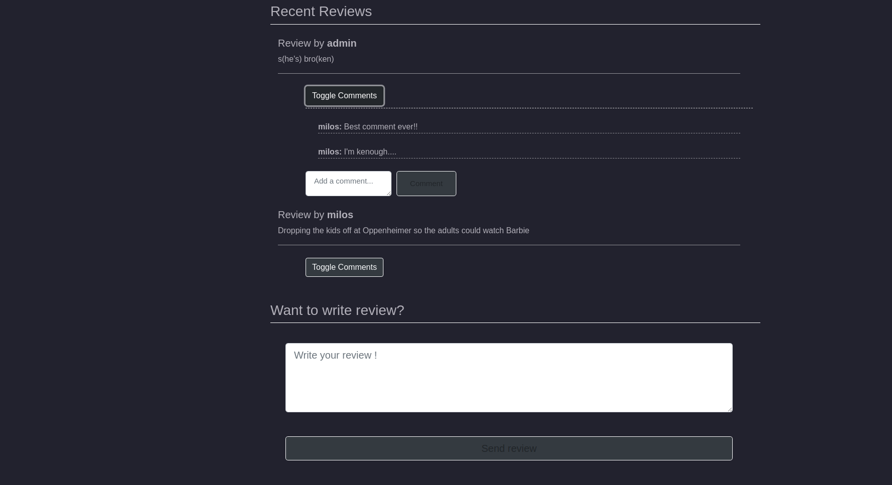

# Movie-App
# Preview
    
    
    
    
    
    
    
    
    
    
    
    
    
## Requirements
* docker and docker compose

## Installation
Firstly, clone the repository from the github to your local folder with the following command:
```
git clone https://github.com/Milosz-cat/Movie-App.git
```

Next, create an `.env` file where the `docker-compose.yml` is and copy the content from the `.env.sample` file. 

To get access to the TMDB API, you need to create an account on the TMDB website and verify your email.
Then go to Profile Icon > Settings > API > Create > DeveloperExample, Accept Terms of Use, Submit Form. 
After this go again to API page and you will be able to copy API KEY and API Read Access Token (BEARER).

To get email functionality you need to create new gmail account and follow steps in this tutorial:
https://dev.to/abderrahmanemustapha/how-to-send-email-with-django-and-gmail-in-production-the-right-way-24ab

If you encounter any problem while trying to key access to tmdb API or functionality to send e-mails write to me and I will share my data with you.

Example:
```env
SECRET_KEY=ENTER_YOUR_SECRET_KEY_HERE
DEBUG=True
ALLOWED_HOSTS=127.0.0.1 0.0.0.0 localhost

TMDB_API_KEY=ENTER_YOUR_TMDB_API_KEY_HERE
BEARER=ENTER_YOUR_BEARER_HERE

EMAIL_HOST_USER = ENTER_YOUR_EMAIL_HOST_USER_HERE
EMAIL_HOST_PASSWORD = ENTER_YOUR_EMAIL_HOST_PASSWORD_HERE

DB_NAME=postgres
DB_USER=milosz
DB_PASSWORD=milosz
DB_HOST=db
```

In the same directory, where the `docker-compose.yml` is, run the following commands:
```
docker compose build
```
## Usage

Before starting docker you can create admin account:
```
docker-compose run --rm -e DJANGO_SUPERUSER_USERNAME=admin -e DJANGO_SUPERUSER_PASSWORD=admin -e DJANGO_SUPERUSER_EMAIL=admin@example.com app python manage.py createsuperuser --no-input
```

To start the container and test the api run the following command:
```
docker compose up
```

Now you can head over to http://127.0.0.1:8000 to test the api

To stop the container run:
```
docker compose down
```


